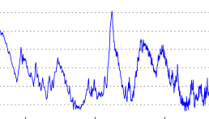

<!-- Prpject Title and Logo -->

[](https://spino.readthedocs.io/en/latest/?badge=latest)


[](https://codecov.io/gh/goodteamname/spino)


<br />
<p align="center">
    
  </a>

  <h3 align="center">SPINO</h3>

  <p align="center">
    A Time Series Visualisation App!
    <br />
    <a href="https://spino.readthedocs.io"><strong>Explore the docs »</strong></a> 
    <br />
    <br />
    <a href=https://github.com/goodteamname/spino/#example>View Demo</a>
    ·
    <a href="https://github.com/goodteamname/spino/issues">Report Issue</a>
    ·
  </p>
</p>

<!-- Table of Contents -->
## Table of Contents

* [About the SPINO Library](#about-the-pk-toolbox)
  * [Background](#background)
* [Getting Started](#getting-started)
  * [Installation](#installation)
* [Usage](#usage)
* [License](#license)
* [Contact](#contact)
* [Acknowledgements](#acknowledgements)

<!-- About the SPINO Library -->
## About SPINO
The SPINO App for time series visualisation is a quick way to undertake lots of common time series analysis methods on one or more time series in a highly intuitive and adaptable way. Gone are the days of writing lines and lines of your own code to compute moving averages on your data, removing seasonality and trends, or even carrying out spectral analysis. All the SPINO app needs is a pandas dataframe containing your time series, and you're free to visualise and analyse at the click of a button in your web browser!

### Background


<!-- Getting Started -->
## Getting Started

Below are our simple installation intructions to quickly get started the SPINO app working locally.

### Installation

1. Begin by cloning this GitHub repo in either a new or existing directory.
```sh
https://github.com/goodteamname/spino.git
```
2. Next, lets setup a virtual environment in the cloned spino directory and pip install the SPINO App's dependencies (Python packages listed in the requirements.txt file).
```sh
cd spino

python3 -m venv venv

pip install -r requirements.txt
```

<!-- Usage -->
## Usage

The SPINO Library is structured as follows:
+ **Tab1:** Time Series - Visualise your raw time series, look at the histogram of it's data points and make use of our sliding rolling mean and standard deviation functions to investigate variability.
+ **Tab2:** Decomposition - Choose a one of your raw time series to decompose, removing the trend by fitting a polynomial of your choosing and then examine the seasonality in your data.
+ **Tab3:** Autocorrelation and Correlation - Examine the correlation your data has with itself over time with auto correlation or look at the correlation between any two specfied series. You can output as many lags as you choose!
+ **Tab4:** Spectral Analysis - Once you have detrended your data with a polynomial of your choosing, view the power spectrum of your time series from a discrete fourier series and examine the top 5 components and their characteristics. You are can choose to view the resulting fourier approximation from as many components as you like, alongside the residual when subtracted from your detrended data. 

**Importing Data**
+ Users can import data by amending the main.py file in *spino/bokeh_app/main.py*. An example dataset, test_timeseries.csv is included for users to ensure the SPINO App is working locally. 
    
For further details on each of the modules underlying the SPINO app view our [docs](https://spino.readthedocs.io).

<!-- License -->
## License

Distributed under the MIT License. See LICENSE file for further details. 

<!-- Acknowledgements -->
## Acknowledgements

* Adapted README.md from opensource template: 
https://github.com/othneildrew/Best-README-Template/blob/master/README.md
